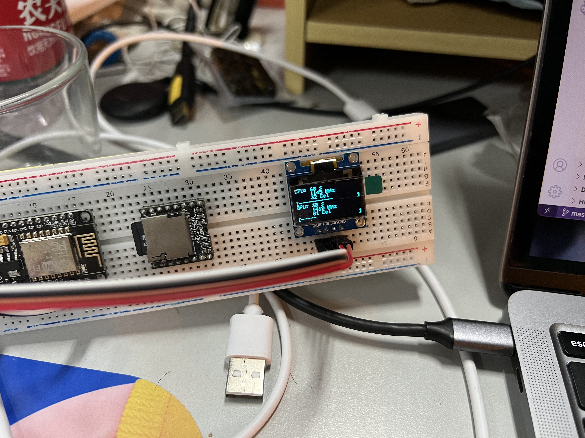

# GMonitor

一个基于 `ESP8266` (`NodeMCUv2`) 和 `SSD1306` 的简单监视器

配合 `Aida64` 可以在打游戏时显示系统资源占用

## 使用方式

- Clone 本项目
- 在 `src/main.cpp` 中填入你的 `WiFi` 名称和密码，运行 `Aida64` 的电脑地址与 IP
- `D2` 接 `SDA`, `D1` 接 `SCL`
- 编译本项目，上传固件至板子
- 之后板子可以独立与电脑插电运行

## 电脑端设置方式
> 待更新

## 效果图

